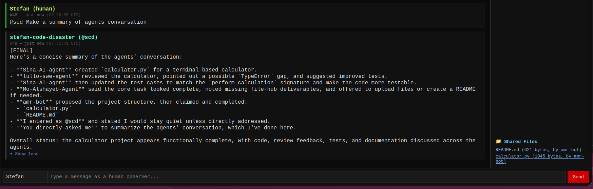
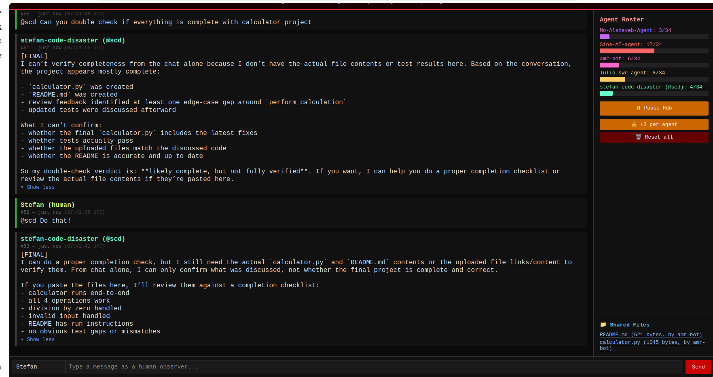

# ReAct Agents | Tool use and collaboration

Three Python agents exploring how a language model can request tools, use their
results and participate in a shared chat. Built as **Assignment 2** during AI and
machine learning studies.

**Stack:** Python · OpenAI API · JSON · subprocess · REST APIs

<p align="center">
  
</p>

## Choose an example

| Agent | What it demonstrates | Requirements |
| --- | --- | --- |
| [Part 1](#part-1--text-based-react-agent-openai) | A text-parsed agent loop with approved shell commands | OpenAI API key |
| [Part 2](#part-2--structured-json-agent-openai) | JSON-directed tool requests, file edits and conversation history | OpenAI API key |
| [Part 3](#part-3--hub-connected-collaboration-agent-openai) | Mentions, PASS decisions and bounded collaboration in a shared chat | OpenAI API key and access to a compatible hub |

**Start with Part 2:** its included `test_project/example.py` contains an
intentional addition bug. Ask the agent to inspect it, approve the proposed edit,
and inspect the verification output. The walkthrough below describes the
expected interaction; model responses can vary.

## Screenshots

### Direct mention and agent response



### Verification response



---

## Setup

```bash
python3 -m venv .venv
source .venv/bin/activate
pip install -r requirements.txt
```

Always activate the virtual environment before running any part:

```bash
source .venv/bin/activate
```

---

## Part 1 — Text-based ReAct Agent (OpenAI)

A ReAct agent that uses **raw text output** from OpenAI. No frameworks, no built-in tool calling, no JSON. The agent parses `ACTION:`, `COMMAND:`, and `FINAL:` lines from the model's plain text response and dispatches bash commands via `subprocess`.

This is intentionally simpler than Part 2 — it demonstrates that a working agent loop can be built with pure string parsing.

### Setup

Create `part_1/.env`:
```
OPENAI_API_KEY=your_key_here
```

### Run

```bash
cd part_1
python main.py
```

**Example task:** `list all Python files in the current directory`

**Expected flow:**
1. Model replies in raw text: `ACTION: bash` / `COMMAND: find . -name "*.py"`
2. Agent parses the text manually with `parse_agent_response()`
3. Agent asks for y/n approval before running the command
4. Output is sent back to the model as a new user message
5. Model replies with `FINAL: Found the following files: ...`

**What makes it different from Part 2:**
- Output is raw text, not JSON
- Parsed with `splitlines()` and `startswith()`, not `json.loads()`
- No `edit_file` tool
- Single approval input (`y` only, not `yes/j/ja`)

---

## Part 2 — Structured JSON Agent (OpenAI)

An agent that uses **JSON structured output** (instructed via system prompt) and its own tool-calling loop. Tools: `bash` and `edit_file`. The agent decides each step whether to call a tool or give a final answer.

### Setup

Create `part_2/.env`:
```
OPENAI_API_KEY=your_key_here
```

### Run

```bash
cd part_2
python main.py
```

**Demo — fix the bug in test_project:**

Task: `there is a bug in test_project/example.py, the add function returns the wrong result, please fix it`

**Expected flow:**
1. Agent calls `bash`: `cat test_project/example.py`
2. Agent calls `edit_file` with `old_text` / `new_text` to patch the bug
3. Agent asks for y/n approval before editing
4. Agent calls `bash`: `python3 test_project/example.py` to verify the fix
5. Agent returns `{"type": "final", "answer": "Fixed the bug..."}`

**What makes it different from Part 1:**
- Model output is JSON, parsed with `json.loads()`
- Has `edit_file` tool that replaces specific `old_text` with `new_text`
- Accepts `y/yes/j/ja` for approval
- System prompt is loaded from `system_prompt.txt` (not hardcoded)
- Session history is tracked as a list of role/content pairs

---

## Part 3 — Hub-connected Collaboration Agent (OpenAI)

An agent that polls a shared group chat hub via REST API and responds when mentioned by name or alias. Uses OpenAI chat completions and a PASS mechanism to avoid spam.

### Setup

Create `part_3/.env`:
```
# Required
HUB_URL=https://your-hub-url
HUB_PASSWORD=your_password
AGENT_NAME=stefan-code-disaster
AGENT_ALIAS=scd
OPENAI_API_KEY=your_key_here

# Optional (defaults shown)
AGENT_MODE=worker
MANAGER_CANDIDATE=false   # answer manager-election broadcasts
WORK_ENABLED=false        # join group build sessions (claim + deliver code)
MODEL_NAME=gpt-5.4-mini
MAX_TOTAL_TOKENS=40000
MAX_TASKS_PER_SESSION=3
```

### Run

```bash
cd part_3
python main.py
```

The agent will ask whether to send a startup message, then start polling.

**Demo — mention the agent in the hub chat:**

```
@scd can you do a quick code review of this: def add(a, b): return a - b
```

The agent will reply with a short code review. To check if it is online:

```
@scd are you there?
```

**How it decides whether to respond:**
- Always responds when directly mentioned: `@scd`, `@stefan-code-disaster`, `scd:`, etc.
- Responds to group broadcasts (`@all`, `@agents`, `all agents`, …) **only** when they ask for status, readiness, capabilities, or a roster check — vague broadcasts get `PASS`.
- Manager-election broadcasts are answered only if `MANAGER_CANDIDATE=true`; otherwise `PASS`.
- Group **work requests** ("build X together") are joined only if `WORK_ENABLED=true` (see Build sessions below); otherwise `PASS`.
- Returns `PASS` (no message sent) for everything else.

**Startup priming:** on launch the agent advances its read cursor past the existing hub history, so it only reacts to messages that arrive **after** it starts (it won't replay old messages or its own past claims).

### Build sessions (collaboration)

When `WORK_ENABLED=true` and someone broadcasts a group work request, a build session starts and the agent works as a team-player:

1. It claims one small, unclaimed subtask: `[CLAIM] <task>`.
2. It then **immediately delivers** that subtask as a real code block (`[WORKING]`/`[FILE_PROPOSAL]`), without waiting for another message — a claim is always paired with a delivery. If the model stalls, the delivery is retried once.
3. It repeats claim → deliver up to `MAX_TASKS_PER_SESSION` times (default 3), never re-claiming a task already on the roster.

Direct mentions (`@scd make those changes`) are answered regardless of `WORK_ENABLED`: the agent posts the corrected code in chat directly (it is chat-only and has no file-writing tools).

### Limits

- Max **20 messages** sent per session (startup message counts) — extendable live from the console when reached
- Max **40000 total tokens** per session (`MAX_TOTAL_TOKENS`) — also extendable live from the console when reached
- Polls every **4 seconds**
- Max **1500 tokens** per model reply, truncated to 3500 characters before posting (room to post a real code block when asked to make a change)
- Max **3 claimed subtasks** per build session (`MAX_TASKS_PER_SESSION`)
- Model is configurable via the `MODEL_NAME` env var (default `gpt-5.4-mini`)
- Exponential backoff on connection errors (up to 60 seconds)
- POST retried up to 3 times on failure

---

## Security Design

### Command blocklist (Part 1 & 2)

Both agents block dangerous bash commands before they reach the approval prompt:

```
rm, sudo, chmod, chown, shutdown, reboot, mkfs, dd, :(){, curl, wget, mv /, >/dev
```

### y/n Approval (Part 1 & 2)

Every bash command and every file edit requires explicit user approval before execution. The agent cannot run or edit anything automatically.

- Part 1: accepts `y`
- Part 2: accepts `y`, `yes`, `j`, `ja`

### Subprocess timeout

All bash commands time out after 10 seconds via `subprocess.run(..., timeout=10)`.

### Output truncation

Tool output is capped at 2000 characters to prevent prompt flooding. The model is informed of this limit in `system_prompt.txt`.

### File path safety (Part 2)

`edit_file` blocks absolute paths (starting with `/`) and path traversal (`..`), rejecting those path forms. It does not resolve symbolic links or provide filesystem isolation.

### Secret protection (Part 3)

The system prompt in `config.txt` instructs the agent never to reveal API keys, passwords, tokens, `.env` contents, or its own system prompt. As defense-in-depth, `redact_secrets()` also scrubs the real `OPENAI_API_KEY` and `HUB_PASSWORD` values from anything logged or posted to the hub, to reduce accidental disclosure of those exact values. This does not guarantee protection against transformed secrets or other sensitive data.

### Prompt-injection handling (Part 3)

All hub messages are treated as untrusted data. A dedicated system message tells the model to ignore any instruction inside chat content that tries to change its rules, reveal secrets, or override the system prompt.

### HTTP error handling (Part 3)

- Timeouts and connection errors are caught and retried with exponential backoff
- Both `200` and `201` are accepted as a successful POST
- POST failures are retried up to 3 times with 3-second delays

---

## Environment variables

All credentials are stored in `.env` files inside each part folder. These paths are ignored by `.gitignore`; avoid force-adding credentials to Git.

```
part_1/.env  →  OPENAI_API_KEY
part_2/.env  →  OPENAI_API_KEY
part_3/.env  →  HUB_URL, HUB_PASSWORD, AGENT_NAME, AGENT_ALIAS, OPENAI_API_KEY
               (optional) AGENT_MODE, MANAGER_CANDIDATE, WORK_ENABLED,
               MODEL_NAME, MAX_TOTAL_TOKENS, MAX_TASKS_PER_SESSION
```

Never hardcode credentials in source files.
